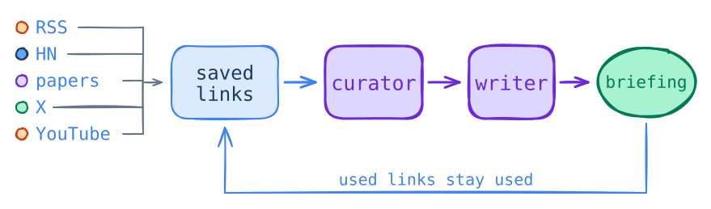

# cron-agents

I built cron-agents to turn the feeds I care about into one useful daily briefing.



The curator chooses the sources. The writer researches them. A final editor makes the briefing easy to read and checks the sources again. SQLite prevents repeats.

## Set it up with an agent

Paste this prompt into Codex, Claude Code, Kimi, or another coding agent:

```text
Set up cron-agents from https://github.com/oEdyb/cron-agents on this machine.
Follow README.md and use Codex unless I ask for Kimi.
Ask me which sources and topics I care about.
Keep config.yaml and credentials private.
Use the existing commands and config without adding Docker or extra services.
Run the test suite, each collector, and one briefing.
Verify that the writer and editor receive only the sources selected by the curator.
The editor must open and edit draft.md in its private workspace and research those links.
Check that the source links work and published sources cannot be selected again.
Do not schedule it until these checks pass.
Then ask what time I want it to run each day.
```

## Run your first briefing

You need macOS or Linux, Git, Python 3.12 or newer, and Codex. Install Codex if `codex --version` doesn't work:

```bash
curl -fsSL https://chatgpt.com/codex/install.sh | sh
```

Open a new terminal, sign in, and install the project:

```bash
codex login
git clone https://github.com/oEdyb/cron-agents.git
cd cron-agents
python3 -m venv .venv
.venv/bin/pip install -e .
cp config.example.yaml config.yaml
```

The included feeds need no API keys, so you can run them as-is. Edit two fields when you want to make it yours:

- `jobs.briefing.context`: what you know, what you care about, and what to skip
- `jobs.rss.feeds`: RSS, Atom, and YouTube feed URLs

Collect sources, then run the curator, writer, and editor:

```bash
.venv/bin/cron-agents run rss
.venv/bin/cron-agents run hn
.venv/bin/cron-agents run papers
.venv/bin/cron-agents run arxiv
.venv/bin/cron-agents run briefing
```

Open `briefings/YYYY-MM-DD.md`. The curator keeps every strong source, so the count changes with the day. The writer researches only those stories, and the editor reads the full draft before it is saved. Each source link sits beside the text it supports.

## Run it every day

Run one briefing by hand before adding a schedule. A coding agent can use the prompt above to create a native schedule for Linux or macOS.

For Linux, replace `your_name` and add this to `crontab -e`:

```cron
APP=/home/your_name/cron-agents
PATH=/home/your_name/.local/bin:/home/your_name/.kimi-code/bin:/usr/local/bin:/usr/bin:/bin

0 */3 * * * cd "$APP" && flock -n .run.lock .venv/bin/cron-agents run hn
30 */6 * * * cd "$APP" && flock -n .run.lock .venv/bin/cron-agents run rss
30 20 * * * cd "$APP" && flock -n .run.lock .venv/bin/cron-agents run papers
40 20 * * * cd "$APP" && flock -n .run.lock .venv/bin/cron-agents run arxiv
0 21 * * * cd "$APP" && flock -n .run.lock .venv/bin/cron-agents run briefing
```

Cron uses the machine's timezone. Use the same Linux account for the schedule and the model login. On a headless server, run `codex login --device-auth`.

### Ubuntu 24.04

If the editor fails with `bwrap: loopback: Operation not permitted`, Ubuntu blocked Codex's file sandbox. Keep the server-wide protection on.

- Plain cron: give the native Codex binary a narrow AppArmor `userns,` rule.
- Hardened systemd: let the service limit writes and set only the editor to `danger-full-access`.

Test through the same cron or service before scheduling it. [Ubuntu documents the restriction here](https://ubuntu.com/blog/ubuntu-23-10-restricted-unprivileged-user-namespaces).

## Change the workflow

Use these files and fields:

| Change | Where |
|---|---|
| Sources | `jobs.rss.feeds` in `config.yaml` |
| Taste and audience | `jobs.briefing.context` in `config.yaml` |
| Curator and writing | `prompts/curator.md` and `prompts/writer.md` |
| Models | `agents.curator.model`, `agents.writer.model`, and `agents.editor.model` |
| New source type | Copy a collector module into `cron_agents/jobs/`, then set the new job's `module` field in `config.yaml` |
| Private source | Send newline-delimited JSON into `.venv/bin/cron-agents import -` |

To use [Kimi Code](https://moonshotai.github.io/kimi-code/en/guides/getting-started.html), run `kimi login`, export `KIMI_CODE_EXPERIMENTAL_FLAG=1`, then set the curator, writer, and editor models to `kimi`, `kimi-web`, and `kimi-edit`. Add the variable to its schedule.

Git ignores `.venv/`, `config.yaml`, `data/`, `briefings/`, and local install metadata. Keep `data/state.db`: it records published sources so they cannot appear in another briefing.

## Test changes

The tests use local fixtures and need no model login or network access:

```bash
.venv/bin/pip install -e '.[dev]'
.venv/bin/ruff check .
.venv/bin/pytest
```
